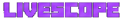
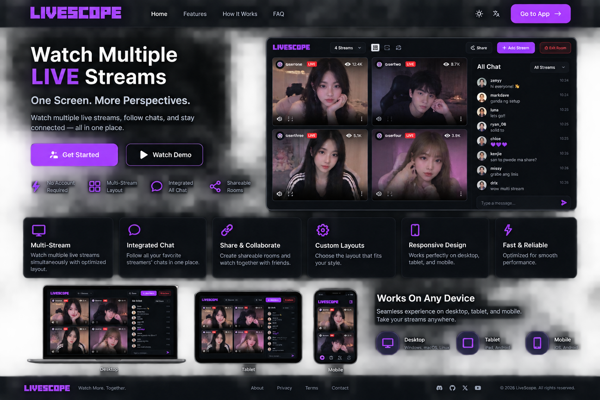

<p align="center">
  
</p>

<p align="center">
  <strong>Watch multiple LIVE streams. One screen. More perspectives.</strong>
</p>

<p align="center">
  A dark, responsive multi-stream dashboard with an integrated All Chat panel, saved layouts, shareable rooms, per-stream reconnects, and portrait-friendly playback.
</p>

<p align="center">
  <a href="#quick-start">Quick Start</a> ·
  <a href="#features">Features</a> ·
  <a href="#deploy-to-vercel">Vercel</a> ·
  <a href="#architecture">Architecture</a>
</p>

---

## Preview

<p align="center">
  
</p>

> **Preview image:** the visual direction and layout concept for LiveScope. The production UI is designed around the same dark, high-contrast multi-stream experience.

## What is LiveScope?

**LiveScope** is a browser-based multi-LIVE monitoring workspace. It is designed for people who want to watch several public LIVE streams at the same time without constantly switching tabs.

The monitor room combines a multi-stream video grid with an optional **All Chat** sidebar, while keeping each stream independent so one stream can reconnect without reloading the rest of the room.

> LiveScope is an independent project and is **not affiliated with TikTok or ByteDance**. It uses public web/stream interfaces and third-party realtime services where configured.

## Features

### Multi-stream monitoring

- **2×2, 3×3, and 4×4** layouts
- Drag-and-drop monitor ordering
- Portrait-friendly playback with **Fit: Full** and crop mode
- Per-stream fullscreen
- Per-stream audio focus
- Viewer count and LIVE status
- Centered connecting/offline/retry states
- Refresh/reconnect **one stream at a time**

### Integrated All Chat

- One side panel for chats from multiple LIVE streams
- **Dropdown stream selector** instead of a growing row of buttons
- Automatic color for each stream source
- Search chat messages
- Filter by event type
- Pause, clear, and auto-scroll controls
- Clickable source labels for stream-level filtering

### Rooms & layouts

- Save layouts locally
- Reopen saved monitor arrangements
- Shareable room URLs
- **Exit Room** flow that stops the current room and returns to Home
- Start a fresh room without carrying over the previous room state

### Responsive UI

- Desktop-first monitoring workspace
- Tablet-friendly controls
- Mobile layout with a collapsible/fixed All Chat panel
- Horizontal toolbar overflow is contained instead of expanding the whole page
- Monitor overflow stays inside the monitor workspace rather than stretching the document

## Quick Start

### Requirements

- Node.js **22+**
- npm
- An **Euler Stream API key** for realtime All Chat

### Install

```bash
npm install
npm run setup
```

Create or edit `.env`:

```env
PORT=8787
EULERSTREAM_API_KEY=YOUR_KEY_HERE
```

Do **not** commit `.env`.

Start the app:

```bash
npm run dev
```

Open:

- Home: `http://localhost:8787/`
- Monitor: `http://localhost:8787/monitor`

## Useful commands

```bash
npm run dev       # local development server
npm run start     # start server
npm run setup     # create .env from .env.example if missing
npm run check     # syntax checks
npm test          # smoke tests
npm audit         # dependency audit
```

`npm run setup` will **not overwrite an existing `.env`**.

## Environment variables

| Variable | Required | Purpose |
|---|---|---|
| `PORT` | No | Local HTTP port. Defaults to `8787`. |
| `EULERSTREAM_API_KEY` | For All Chat | Server-side realtime chat connection. |

The Euler API key is only read by the server. It should never be placed in browser code, committed to Git, or pasted into an issue.

## Deploy to Vercel

LiveScope includes the Vercel-ready Express structure used by this project.

### 1. Install and verify locally

```bash
npm install
npm run check
npm test
npm audit
```

### 2. Deploy a preview

```bash
npm install -g vercel@latest
vercel login
vercel
```

### 3. Add the server secret

In **Vercel → Project → Settings → Environment Variables**, add:

```text
EULERSTREAM_API_KEY=YOUR_KEY_HERE
```

Add it to the environments you actually use (Preview and/or Production). Then redeploy.

### 4. Production

```bash
vercel --prod
```

> **Realtime note:** LiveScope's All Chat connection is stateful on the server side. Before treating a Vercel deployment as production-ready, test the realtime chat path on the exact Vercel runtime you plan to use. Video playback and chat are intentionally separated so a chat failure does not have to take down the video grid.

## Architecture

```text
                         ┌───────────────────────┐
                         │       LiveScope        │
                         │   Home + Monitor UI   │
                         └───────────┬───────────┘
                                     │
                 ┌───────────────────┴───────────────────┐
                 │                                       │
                 ▼                                       ▼
        ┌─────────────────┐                     ┌─────────────────┐
        │ TikTok LIVE     │                     │ Euler Stream    │
        │ room / playback │                     │ realtime chat   │
        └────────┬────────┘                     └────────┬────────┘
                 │                                       │
                 ▼                                       ▼
        ┌─────────────────┐                     ┌─────────────────┐
        │ HLS playback    │                     │ All Chat bridge │
        │ + per-tile      │                     │ + filters       │
        │ reconnect       │                     │ + SSE to UI     │
        └────────┬────────┘                     └────────┬────────┘
                 └──────────────────┬────────────────────┘
                                    ▼
                          ┌─────────────────────┐
                          │  Monitoring Room    │
                          │  2×2 / 3×3 / 4×4   │
                          └─────────────────────┘
```

## Project structure

```text
livescope-v1.8-vercel/
├── public/
│   ├── home.html         # Landing page
│   ├── home.css
│   ├── index.html        # Monitor room
│   ├── styles.css
│   └── app.js
├── server/
│   └── index.js          # Express server + resolver + chat bridge
├── scripts/
│   ├── setup-env.js
│   └── smoke-test.mjs
├── docs/
│   └── assets/
│       ├── livescope-logo.png
│       └── livescope-preview.png
├── .env.example
├── .gitignore
├── .vercelignore
├── package.json
└── README.md
```

## Security notes

- Keep `.env` out of Git.
- Keep the Euler API key server-side.
- Do not expose the API key in client JavaScript or public URLs.
- The HLS proxy accepts only known TikTok/CDN host patterns.
- If you fork this project, review third-party services, platform rules, and stream/data usage before making the site public.

## Current status

**Working project goals:**

- Multi-stream dashboard
- Individual stream reconnects
- Responsive monitor workspace
- All Chat UI and filtering
- Saved layouts
- Shareable room state
- Home → Room → Exit Room flow
- Vercel-ready packaging

**Still environment-dependent:**

- TikTok playback availability can change with upstream web behavior.
- All Chat requires a valid realtime service/API key.
- Production realtime behavior should be verified on the chosen hosting runtime before public launch.

## Roadmap ideas

- Better room persistence for logged-in users
- Public room names and room ownership
- Favorite stream lists
- Per-stream quality selection
- Chat moderation tools
- More flexible custom grid sizes
- Performance controls for high-count monitoring rooms

---

<p align="center">
  <strong>LiveScope</strong><br>
  Watch more. Switch less.
</p>
